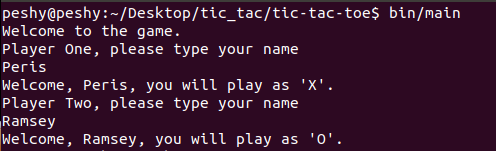
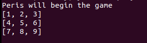
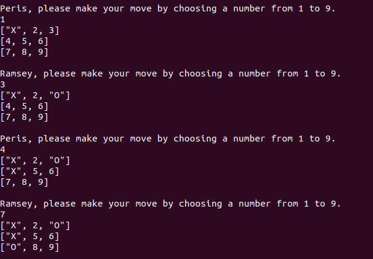
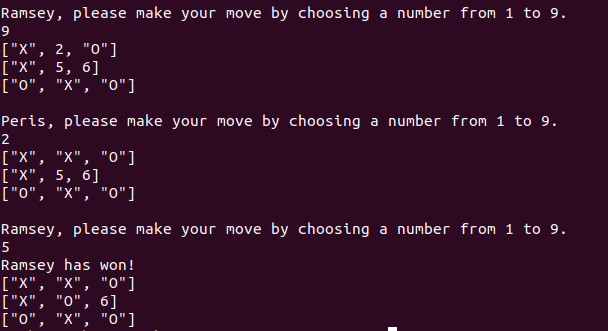
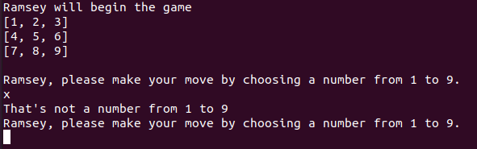
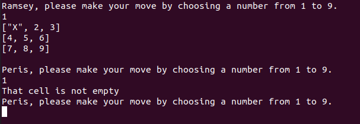

## Tic-Tac-Toe

> In this project, we built a Tic Tac Toe game. The main goal is to put into practice the main concepts of Object Oriented Programming. Particularly, classes, objects and access to their attributes.

## Built With

- Ruby
- VsCode

## Live Demo

  [Live Demo Link](https://repl.it/@RamseyNjire/tic-tac-toe#bin/main)

## How to Play

  This game consists of 2 players.

  The first player to enter their name, or Player One, is assigned 'X', and the second player, or Player Two, is assigned 'O'.

 

  A board, which consists of a 3x3 grid cell, is displayed.

  
  
  The game starts with the first  player choosing any of the cells from 1 to 9. The board is updated with the player's symbol ('X' or 'O') at the cell they chose.

  The next player then picks a cell number and the game continues in alternating fashion.

 
  
  The objective of the game is to fill in 3 cells in a row with your letter, either horizontally, vertically, or diagonally.

  The game ends in one of 2 scenarios: One player succeeds at filling 3 cells in a row or all cells are filled and no player wins, that is a draw. The game will output the appropriate message in either case.

 

 Note that you can't enter anything other than a number from 1-9 when picking a cell. The game will throw an error and ask you to pick a valid number.

  

 Also, you can't pick a cell that has been previously filled with either an 'X' or an 'O'. The game will inform you that the cell is not empty.

 

## Getting Started

To get a local copy up and running follow these simple example steps.
 
 - Clone this repository into your local machine

 - Run the main file by  navigating to whatever directory you cloned the repo into and typing the following in your command line:

     ` cd tic-tac-toe `

     ` bin/main `

- An interesting thing to note here is that, since the main file is an executable, you should be able to run it, even if you're not in the tic-tac-toe folder. All you have to do is type the command `main` on the command line and the game should run. However, seeing as different environments can be unpredictable, if that doesn't work then the above steps are the surest to get the game running.
 

## Validators
- Rubocop via Github Actions

## Authors

👤 **Ramsey Njire**

- Github: [@RamseyNjire](https://github.com/RamseyNjire)
- Twitter: [@untakenramram](https://twitter.com/untakenramram)
- Linkedin: [Ramsey Njire](https://www.linkedin.com/in/ramsey-njire-51984931/)

👤 **Peris Ndanu**

- Github: [@mimipeshy](https://github.com/mimipeshy)
- Linkedin: [Peris Ndanu](https://www.linkedin.com/in/peris-ndanu-405083193/)

## 🤝 Contributing

Contributions, issues and feature requests are welcome!

Feel free to check the [issues page](issues/).

## Show your support

Give a ⭐️ if you like this project!

## 📝 License

This project is [MIT](lic.url) licensed.

